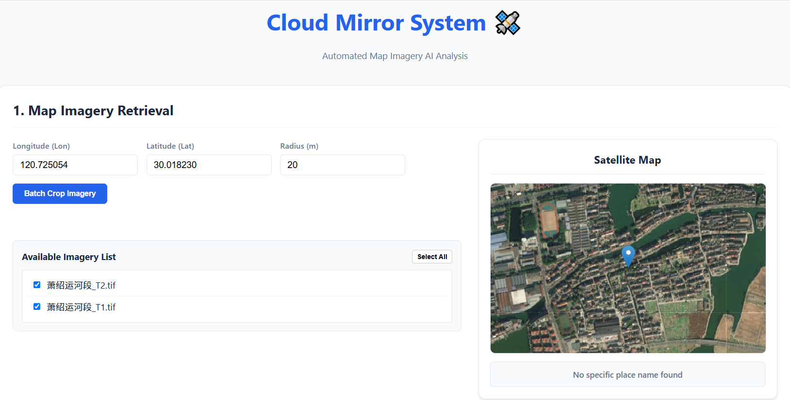
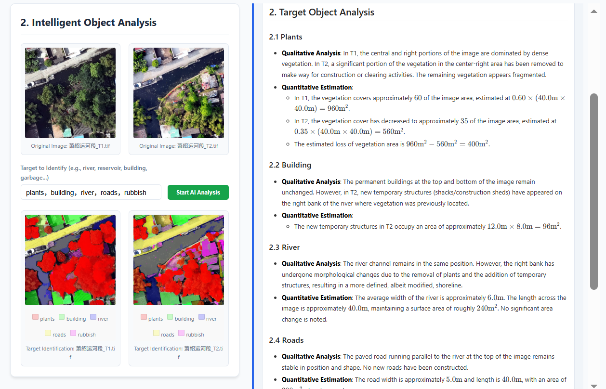

# AutoNavigator

AutoNavigator is an AI-powered imagery analysis system designed for automated target identification, semantic segmentation, and professional report generation. By integrating advanced vision-language models and interactive mapping tools, it streamlines the process of analyzing satellite or aerial imagery.

## 🚀 Key Features

- **Interactive Coordinate Selection**: Integrated with Tianditu maps to allow users to visually select target locations and automatically retrieve longitude, latitude, and place names.
- **Batch Imagery Cropping**: Automatically crops multiple TIF imagery files based on a specified center point and radius.
- **AI-Powered Target Identification**: 
  - **Semantic Masking**: Uses SAM3 (Segment Anything Model 3) to generate precise masks of targets based on natural language instructions.
  - **Intelligent Analysis**: Leverages VLLM (Vision-Language Large Model) to analyze the identified targets and generate detailed descriptive reports.
- **Advanced Visualization**: 
  - **Multi-color Semantic Overlays**: Renders target masks in different colors based on their semantic categories.
  - **Comparison Mode**: A "curtain" or overlay view to compare original imagery with AI-generated masks.
- **Professional Reporting**: Automatically generates comprehensive analysis reports in Markdown format and exports them to professional `.docx` documents.

## 🖼 Screenshots

| Coordinate Selection | Target Analysis |
| :---: | :---: |
|  |  |

## 🧠 Design Philosophy: SAM3 + LMM Synergy

AutoNavitator employs a unique hybrid architecture combining **SAM3 (Segment Anything Model 3)** and a **Large Multimodal Model (LMM/VLLM)** to overcome the inherent limitations of using either model in isolation.

### The Workflow
1. **SAM3 Segmentation $\rightarrow$ LMM Analysis**: Instead of asking the LMM to identify targets directly from the raw image, SAM3 first generates precise geometric masks based on user instructions. These masks are then passed to the LMM as visual anchors.
2. **Eliminating Hallucinations**: By providing explicit segmentation masks, we constrain the LMM's focus to specific regions of interest, effectively eliminating "hallucinations" where the model might imagine targets that do not exist.
3. **Noise Filtering**: While SAM3 is powerful, it can produce segmentation noise (over-segmentation). The LMM acts as a semantic filter, analyzing the content within the masks to discard irrelevant noise and retain only true targets.

### Performance Gains
This synergistic approach significantly boosts the system's reliability:
- **Target Identification Accuracy**: $> 98\%$
- **Quantitative Analysis Accuracy**: $> 90\%$

## 🌍 Real-world Application

Building upon this system, we further developed an automated scanning solution for the Grand Canal orthophotos (approximately 140km). This solution can precisely identify all minute changes in orthophotos from different periods based on customer-provided prompts. To achieve this, we deployed the Gemma 4 31B multimodal large model (powered by 4x NVIDIA RTX 4090 GPUs) and the SAM3 MCP service (powered by 2x NVIDIA RTX 4090 GPUs). The entire 140km scan of the Grand Canal orthophotos was completed in approximately 4 hours, with accurate change reports generated.

## 🛠 Tech Stack

### Frontend
- **HTML5 / CSS3 / JavaScript (ES6+)**
- **Leaflet.js**: For interactive map rendering and coordinate handling.
- **Marked.js**: For rendering AI-generated Markdown reports.
- **MathJax**: For displaying mathematical formulas within reports.

### Backend
- **Python**: Core logic and API services.
- **FastAPI**: High-performance web framework for the backend API.
- **SAM3**: For zero-shot target segmentation.
- **VLLM**: For visual reasoning and report generation.
- **Python-docx**: For exporting analysis results to Word documents.

## 📦 Installation & Setup

### Prerequisites
- Python 3.9+
- Node.js (optional, for frontend serving)
- Access to SAM3 and VLLM model weights.

### Setup Steps

1. **Clone the Repository**
   ```bash
   git clone https://github.com/your-username/autonavitator.git
   cd autonavitator
   ```

2. **Install Backend Dependencies**
   ```bash
   pip install -r requirements.txt
   ```

3. **Configure Environment**
   - Update the Tianditu API keys in `frontend/script.js` and the backend configuration.
   - Ensure the model paths for SAM3 and VLLM are correctly set in the backend services.

4. **Run the Application**
   ```bash
   # Start the backend server
   python backend/main.py
   ```
   - Open `frontend/index.html` in a modern web browser.

## 📖 Usage Guide

1. **Location Selection**: Use the interactive map to click a point of interest or manually enter the longitude and latitude.
2. **Imagery Selection**: Select the TIF files from the available list that you wish to analyze.
3. **Cropping**: Set the analysis radius and click **"Batch Crop Imagery"**.
4. **Target Identification**: 
   - Enter a natural language instruction (e.g., *"Identify all parking lots and buildings"*).
   - Click **"Analyze Targets"**.
5. **Review & Export**: 
   - View the identified targets in the gallery.
   - Read the AI-generated analysis report.
   - Click **"Export DOCX Report"** to save the results.

## 📂 Project Structure

```text
AutoNavitator/
├── backend/
│   ├── main.py              # API Entry point
│   ├── core/
│   │   └── agent.py         # AI Orchestration logic
│   └── services/
│       ├── data_service.py    # Imagery processing & cropping
│       ├── sam3_service.py    # SAM3 model integration
│       ├── vllm_service.py    # VLLM model integration
│       └── export_service.py  # DOCX export logic
├── frontend/
│   ├── index.html           # Main UI
│   ├── style.css            # Styling
│   └── script.js            # Frontend logic & Map integration
├── requirements.txt         # Python dependencies
└── README.md                # Project documentation
```

## 📄 License
This project is licensed under the MIT License - see the LICENSE file for details.